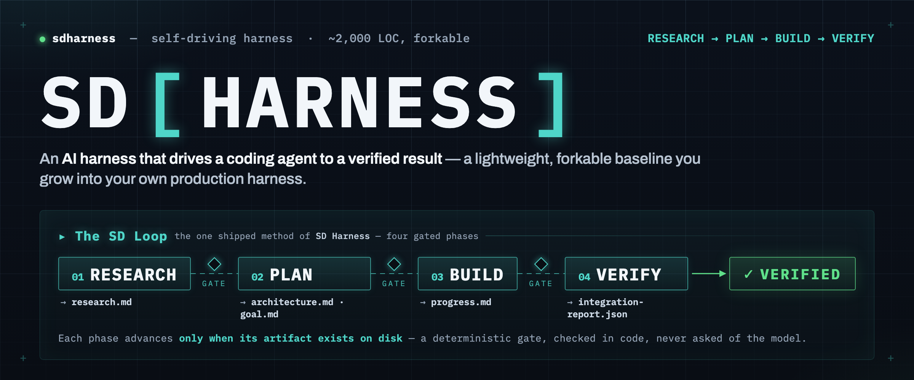
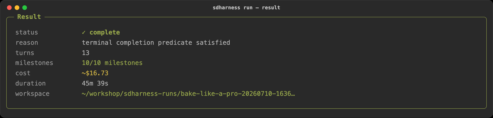
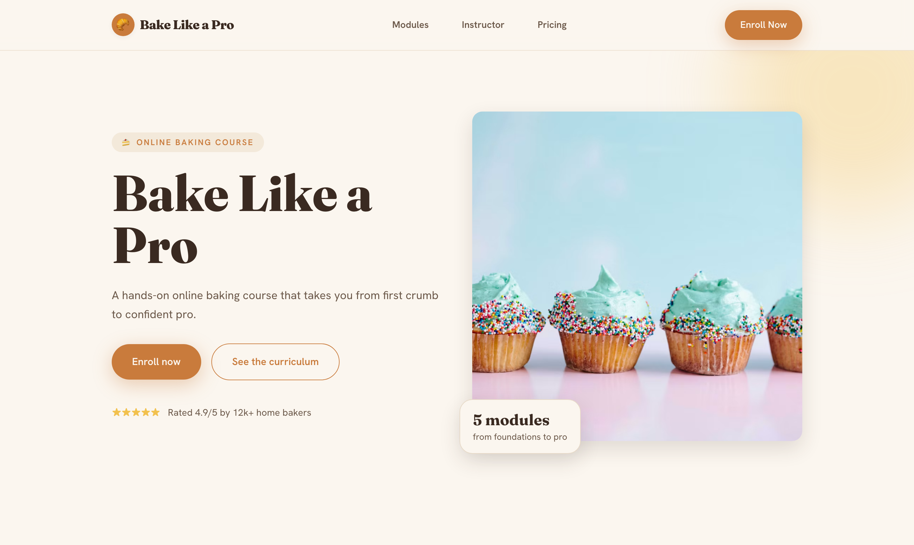

<p align="center">
  
</p>

# SD Harness (Self-Driving Harness) Starter Kit


> [!NOTE]
> **Project status: experimental.** The SDHarness starter kit is **experimental sample code**, provided
> **as-is** for learning and as a forkable baseline. It is **not** production-ready or officially
> supported — review, test, and harden it before any use beyond experimentation. Running it makes real
> Amazon Bedrock model calls that incur cost.
>
> **Contributions welcome.** This kit is designed to be forked and grown; issues and merge requests that
> improve it are encouraged.

**A forkable ~2,000-line baseline for building your own AI harness** — the outer control loop that
drives a coding agent to a *verified* result. A single steering **Pilot** (the outer harness) drives
a coding agent like Claude Code (the inner harness) through a gated methodology, turn by turn, from an
intent doc to a working, self-verified build.

AI made writing code fast; the bottleneck moved from *writing* code to *trusting* it. A harness moves
you **from in the loop to on the loop** — you supervise outcomes at gates instead of reviewing every
turn. **Both agents run on the [Claude Agent SDK](https://docs.claude.com/en/api/agent-sdk/overview)**
(on Amazon Bedrock): the coding agent as a persistent session with full tools, the Pilot as a
separate, read-only reviewer. Fork it as the baseline for your own harness, without reinventing the
wheel.


## Prerequisites

- **Python 3.11+**
- **[`uv`](https://docs.astral.sh/uv/)** (recommended) or `pip`
- **The [Claude Code CLI](https://docs.claude.com/en/docs/claude-code/overview)** — the default coding agent
- **AWS credentials with Amazon Bedrock access** to the Claude models — the kit deploys nothing; a run only makes Bedrock model calls. Configure them in `.env` (copy `.env.example`).

> The kit itself is Python-only. The **frontend worked-examples** (e.g. `bake-like-a-pro`) also need
> **Node.js 18+** to build/preview the site they generate; their VERIFY step may run a Playwright
> smoke test, which the coding agent installs on demand (`npx playwright`) — nothing to pre-install.
> A non-frontend intent (a CLI, a data pipeline) needs neither.

## Learn it in four levels

Follow the path top to bottom — each level builds on the last, and each hands off to a doc for depth.
You can **run** the kit before you understand it, understand it before you customize it, and customize
it before you grow it into your own harness.

| Level | Goal | Go deeper |
|-------|------|-----------|
| **[100 — Run it](#level-100--run-it)** | See it work end-to-end in one command | [Harness Engineering](docs/concepts/harness-engineering.md) |
| **[200 — Understand it](#level-200--understand-it)** | Grasp the SD Loop and why the gates matter | [The mental model](docs/concepts/mental-model.md) · [How it works](docs/how-it-works.md) |
| **[300 — Customize it](#level-300--customize)** | Point it at your use case; author a method | [Customize](docs/customize.md) · [Authoring a method](docs/authoring-a-method.md) |
| **[400 — Grow it](#level-400--grow-toward-your-own-harness)** | Grow the fork toward a production harness | [The Compounding Cycle](docs/concepts/compound-engineering.md) |

> **Prefer to be walked through it by a coding agent?** Install the
> [`sdharness-starter`](skills/sdharness-starter/) skill and ask Claude Code to *"help me learn the SD
> Harness starter kit"* — it concierges you through the whole arc, RESEARCH → 100 → 400.

---

## Level 100 — Run it

*You don't need to understand the internals yet. Run the worked example and watch it go.*

Make sure you have the [Prerequisites](#prerequisites) above, then:

```bash
uv pip install -e .                                   # 1. install (editable, so forks take effect)
cp .env.example .env                                  # 2. set AWS_PROFILE / AWS_REGION / ANTHROPIC_MODEL (+ optional ANTHROPIC_SMALL_FAST_MODEL)
sdharness methods                                     # 3. see what's available
sdharness run ./examples/bake-like-a-pro --method loop   # 4. run it, autonomous
```

The run stops the moment the terminal gate is met (a green `integration-report.json`) — you don't set a
turn target. `--max-turns` is an optional **runaway safety ceiling** (a kill switch, default **100**),
not something you tune per run; the loop finishes far below it. The kickoff banner shows the budget once.
Lower it only to bound a deliberate smoke run. Two more optional guards: `--max-budget <USD>` (a hard
cost ceiling — the run stops cleanly when agent + Pilot spend reaches it) and `--fallback-model <model>`
(the coding agent degrades to a smaller model on rate limits so a long run survives a throttle;
defaults to `$ANTHROPIC_SMALL_FAST_MODEL`). Both carry through `sdharness resume`.

**The CLI *is* the interface** — no dashboard, just a readable stream of the two-harness loop. Each
turn prints its phase, the coding agent's `›` tool calls and narration, then the **Pilot's `GO`/`NO_GO`
+ one-line direction**; phases advance as artifacts satisfy the gates; a final `Result` recap prints
`complete`, the reason, and the turn count.


**What just happened:** the harness drove Claude Code through `RESEARCH → PLAN → BUILD → VERIFY` in
`../sdharness-runs/bake-like-a-pro-<ts>/`, with no human in the turn loop — producing the `goal.md` milestone
contract, a `loop-docs/` dir of generated artifacts (`research.md`, `architecture.md`, `progress.md`,
a green `integration-report.json`, `events.jsonl`), and an on-brand React + Vite baking-course landing
page at the run root. `cd` into the workspace and `npm run dev` to see it.





> This is the kit's **hello world** — a frontend example, chosen because you can *see* the result in
> minutes. The SD Loop itself is domain-neutral; point the same loop at any use case by swapping the
> intent (Level 300). New to the idea of a "harness"? → [Harness Engineering](docs/concepts/harness-engineering.md) `· Level 100`.

### What a run produces

Each run gets its own workspace at `../sdharness-runs/<name>-<ts>/` — a sibling of the kit checkout, so
generated artifacts stay **out of the source tree** (override the base with `$SDHARNESS_RUNS_DIR`; the
run-start banner prints the resolved path):

| Path | What it is |
|------|-----------|
| workspace **root** | the authored intake (`vision.md`, `tech-env.md`), the `goal.md` contract, and the generated project itself — `npm run dev` to see it |
| `goal.md` | the milestone contract BUILD drives, one checkbox per turn — generated by the loop in PLAN (see below), not hand-authored |
| `loop-docs/` | the generated harness artifacts: `research.md`, `architecture.md`, `progress.md`, `events.jsonl` |
| `loop-docs/integration-report.json` | **the VERIFY proof** — the machine-checkable "done" |
| git history | one commit per turn — the audit trail (`git log` the workspace) |

**Why `goal.md` sits at the root, not in `loop-docs/`.** It's **contract vs. bookkeeping**: `goal.md`
is the milestone contract BUILD implements and a human steers by, so it lives at the root like a real
project's spec (the loop generates it in PLAN, or copies a hand-authored one if the intake has it).
Everything in `loop-docs/` is the run's *generated working state*, quarantined in the one dir the gates
key on — so the root reads like a real project, not a tool's scratch folder.

**Interrupted? Resume it.** If a run stops early (Ctrl-C, a crash, a transient model stall),
`sdharness resume ../sdharness-runs/<name>-<ts>` continues it **in place** — it reconstructs the turn count and
running cost from the run's own `events.jsonl`, rolls the workspace back to the last clean turn
checkpoint (the per-turn `git` commits are tagged `turn/N`, so a half-written file from the interrupted
turn is discarded), then picks up on the first unchecked `goal.md` milestone instead of starting over.
The coding agent re-orients from the on-disk artifacts (`goal.md` + `loop-docs/`) rather than restoring
a chat session — the same "artifacts are the memory" idea the layout above rests on. (`sdharness replay
../sdharness-runs/<name>-<ts>` re-renders a finished run from the same log.)

**`integration-report.json` is the definition of "done."** VERIFY makes the coding agent exercise
every real end-to-end seam and record the evidence; the harness completes the run only when the report
is genuinely green (`status: "passed"`, `all_seams_exercised: true`) — checked deterministically, never
asked of the model. *Building isn't the same as working; this is the proof it works.*

---

## Level 200 — Understand it

*The mental model and the one concept that makes it reliable.*

**Two harnesses, one SDK.** The outer harness (the Pilot) reviews, steers, and gates; the inner harness
(the coding agent) writes the code. Same SDK, kept apart by **capability** — the read-only Pilot judges,
the gated coding agent writes. (How that's wired in code → [How it works](docs/how-it-works.md).)

**The SD Loop is a universal methodology, not a website builder.** The one shipped method —
`RESEARCH → PLAN → BUILD → VERIFY` — reasons in generic software terms (components, wiring, seams,
evidence), so the *same* loop drives a CLI, a data pipeline, or a backend service. What aims it at a
domain is the **intent bundle** you hand it.


**Turn vs. phase — two different clocks.** A **turn** is one iteration of the outer loop: the coding
agent does one bounded unit of work, the harness commits it (one git commit), then the Pilot reviews
and returns `GO`/`NO_GO`. Turns are counted globally as an open ordinal (`Turn 1`, `Turn 2`, …), not a
fraction of the ceiling. A **phase** is one of the SD Loop's four methodology stages (RESEARCH → PLAN →
BUILD → VERIFY); it **spans one or more turns** and advances only when its artifact gate passes. So
`Turn 3 · BUILD` means the 3rd turn overall, currently in BUILD — *not* the 3rd turn of BUILD. A run is
roughly ~1 RESEARCH + ~1 PLAN + one turn per `goal.md` milestone in BUILD + ~1 VERIFY — so the total
turns just tracks how finely the plan chunked the work, not a target the loop drives toward.

**The one idea that makes it trustworthy: deterministic gates.** A phase advances only when its
required artifact exists on disk — checked by the harness in code, *never asked of the model*. That
single property is what lets the loop run unattended without going off the rails.

> **"But Claude Code / Kiro / Codex already loop on their own?"** They do — that's the *inner*
> harness. SD Harness is the *outer* one: an independent reviewer, a deterministic "done," and
> enforcement the agent can't override. → [How is this different?](docs/concepts/harness-engineering.md#how-is-this-different-from-just-running-claude-code--kiro--codex)

**Models (both on Bedrock, set in `.env`).** Different-weight models on purpose — you don't need your
most expensive model to *review*: `ANTHROPIC_MODEL` (inner, writes code) defaults to Opus;
`HARNESS_STEERING_MODEL` (outer Pilot, reviews) defaults to Sonnet and falls back to `ANTHROPIC_MODEL`.

Read next, in order:
- [The mental model](docs/concepts/mental-model.md) `· 100` — **start here:** harness, loop & compounding as three axes of one loop
- [Harness Engineering](docs/concepts/harness-engineering.md) `· 100` — structure per turn; inner vs. outer; the swappable Pilot
- [How it works](docs/how-it-works.md) `· 200` — one run traced through the ~2,000-line core
- [Loop Engineering](docs/concepts/loop-engineering.md) `· 100` · [The Compounding Cycle](docs/concepts/compound-engineering.md) `· 200`

---

## Level 300 — Customize

*Make it yours. Everything below is zero- or low-code.*

**Point it at your own use case** — copy the example bundle, rewrite the brief, run. Nothing else
changes (the harness, method, and skill are reusable; only the intent is domain-specific):

```bash
cp -r examples/bake-like-a-pro examples/my-product
$EDITOR examples/my-product/vision.md      # your goal, vibe, must-haves, and "done ="
sdharness run ./examples/my-product --method loop   # no --max-turns → defaults to 100 (a safety ceiling)
```

**Author your own method or strategy** (pure JSON + a prompt, resolved project-local, no reinstall),
and **compound your runs** so each improves the next:

```bash
cp -r methods/loop harness-methods/mymethod       # add a method → --method mymethod
sdharness compound ../sdharness-runs/<name>-<ts>  # lift a run's lessons into agent-context/LESSONS.md
```

`sdharness compound` promotes a run's `progress.md` `## Patterns` into `agent-context/LESSONS.md`
(title-deduped), so the *next* run reads them and starts smarter. Then install dev tools and gate every
change: `uv pip install -e ".[dev]"` && `pytest -q` — `tests/test_readiness.py` rejects the config
bugs (unsatisfiable gates, missing terminal gate) that cause runaway loops.

Go deeper: [Customize — the fork playbook](docs/customize.md) `· 300` ·
[Authoring a method](docs/authoring-a-method.md) `· 300` ·
[Authoring a strategy](docs/authoring-a-strategy.md) `· 300`

---

## Level 400 — Grow toward your own harness

*Grow the fork past the teachable core into **your own** production harness — as far along the
autonomy curve as your use case needs.*

The kit is a **seed, not a destination.** A capable coding agent can already build a harness; what's
missing is a starting point + steering context. **Your agent does the growing**, toward *your* harness,
along the [AI Dark Factory](#the-maturity-curve) direction (deterministic, harness-owned enforcement
replacing human oversight *inside* the loop).

- **Start from current practice (RESEARCH).** Before you invest, have the coding agent pull *current*
  harness/loop/compound-engineering practice and reconcile it against what the kit ships — an advisory,
  dated `research-notes.md`, human-reviewed, never auto-applied.
- **Grow with a worked example, not a blueprint.** [`reference/expansion-ideas/`](reference/expansion-ideas/)
  reverse-engineers one *mature* harness into 8 docs (architecture, components, APIs…) — an
  illustrative catalog of proven options to borrow ideas from, *not* a spec to replicate.
- **The concierge skill drives this.** Ask Claude Code (with [`sdharness-starter`](skills/sdharness-starter/))
  to *"help me grow my harness"* — it runs RESEARCH, then walks the capability map (multi-reviewer
  board, more methods, pipeline/conductor, eval write-back, other coding agents, MCP, observability),
  each tied to a kit seam and one upstream example. However far you take it, the **two invariants**
  hold: deterministic phase advancement + a generator/evaluator split.

---

## Layout

```
harness/                     the core (~2,000 LOC): loop, sandbox, gates, phase_authority, steering, killswitch
methods/loop/                the SD Loop method (JSON + system prompt)
strategies/loop-autopilot/   the single steering Pilot (JSON + prompt)
agent-context/               CLAUDE/QUALITY/LESSONS/STEERING seed + intent templates (the compounding surface)
examples/bake-like-a-pro/    the worked-example intent bundle · examples/mini-factory/ the Level-400 capstone (+ mini-factory-aws: its Lambda-MicroVM cloud graduation)
skills/frontend-design/      vendored design skill the SD Loop attaches
skills/sdharness-starter/    concierge skill: a coding agent that teaches the kit
docs/                        concept docs (mental-model, harness/loop/compound) + how-it-works, authoring, customize
reference/expansion-ideas/   RE of a mature harness — one worked example for Level 400 (not a blueprint)
tests/                       config + readiness-gate tests
```

### The maturity curve

This kit is the on-ramp of a progression:

**sdharness-starter-kit → sdharness → sdharness-factory**

- **starter kit** (this repo) — the distilled ~2,000-line baseline: single-SDK (Claude Agent SDK for
  both harnesses — one fewer dependency, but a **Claude-locked reviewer**), one method, deterministic
  gates, a lean compounding seed + `sdharness compound`.
- **sdharness** — the full local product: the Pilot runs on a model-agnostic SDK, a multi-reviewer
  board with domain-veto consensus, many methods, pipeline, conductor, and automatic evaluator-driven
  knowledge write-back.
- **sdharness-factory** — hosted/scaled: managed runs plus a centralized shared knowledge base so
  compounding spans a whole team. Want a taste? The [`mini-factory`](examples/mini-factory/) example
  has the kit **build a local control plane over itself** — a browser that launches runs and streams
  their events — the factory rung in miniature, built by the loop. Its cloud graduation,
  [`mini-factory-aws`](examples/mini-factory-aws/), is a brownfield build on top of it that swaps the
  local subprocess runner for an **AWS Lambda MicroVM** (each run in an isolated Firecracker sandbox) —
  proving the factory frontend is backend-agnostic; only the runner graduates.

Compounding grows along the curve: **local seed → per-user + review-gated promotion → centralized
shared KB**. Start lean here; move up when your needs do.

## Contributing & security

Contributions welcome — see [CONTRIBUTING.md](CONTRIBUTING.md) for dev setup and the test gate, and
[CODE_OF_CONDUCT.md](CODE_OF_CONDUCT.md). To report a security issue, follow [SECURITY.md](SECURITY.md)
(please don't open a public issue for vulnerabilities).

## License

Apache-2.0 — see [LICENSE](LICENSE).
</content>
