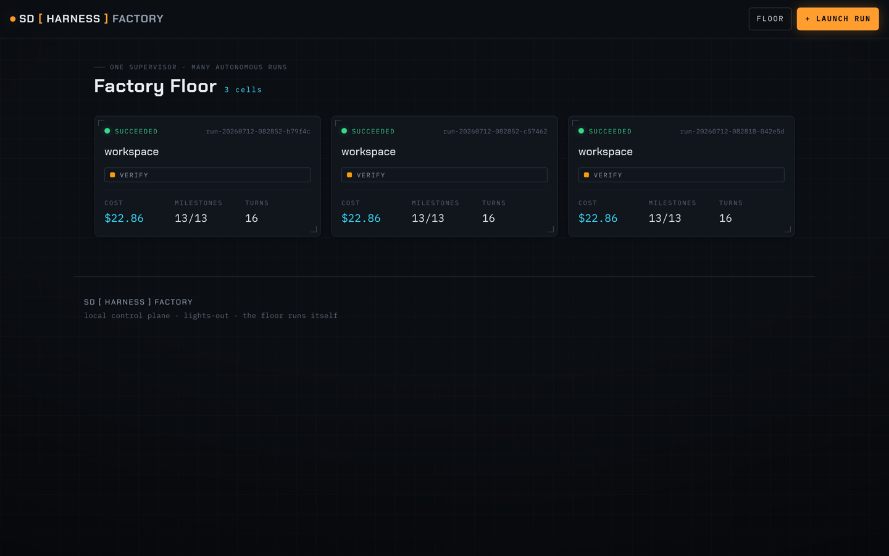
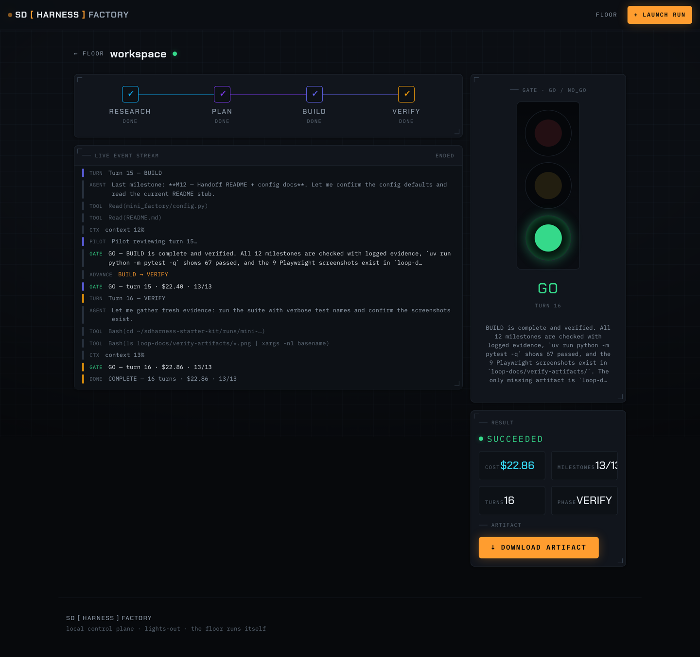

# Mini SD Harness Factory on AWS — a remote, distilled `sdharness-factory`

The local [`mini-factory`](../mini-factory/) builds a browser control plane over the harness — launch
→ observe → result — with a **subprocess runner** on your laptop. This example is the **sandbox factory**:
it graduates that control plane so each run executes in its own **Firecracker-isolated AWS Lambda MicroVM
sandbox**, streaming to the *same* Lights-Out UI — with the factory differences: the built **deliverable
is retrievable** (`workspace.tar.gz`), you run a **fleet at once**, events are **durable**, and each run
**compounds** into the next. Single-user, IDE-run (multi-user hosting is the next rung — see the arc below).

**It builds in two tiers — one launcher, verified two ways** (one `goal.md`, two sequential stages; Tier 2
is one real call on top of Tier 1, not a separate path):
- **Tier 1 (required, green on ANY account):** the whole control plane, verified by running the **real
  `sdharness` CLI as a local subprocess** (the factory *consumes* the installed kit) — only the AWS
  `lambda-microvms` client is mocked. No live MicroVM provisioned.
- **Tier 2 (gated live rung):** bake a customer MicroVM image and fire **one real `RunMicrovm`** — an
  actual cloud VM runs `sdharness` and hands back a downloadable artifact. Runs only when the live-MicroVM
  capability is enabled; otherwise the build stops green at Tier 1.

Still **built by `sdharness` itself** — the harness operating one rung up, over its own cloud runner.

## The point

- **Brownfield graduation, not a rewrite.** You build the local mini-factory first, then run this
  example **on top of it** — RESEARCH audits the existing launch/stream/result/registry frontend, and
  PLAN/BUILD swap only the backend: subprocess → a launcher that starts a Lambda MicroVM, a worker that
  runs the real `sdharness` inside it, and the run's `events.jsonl` streamed out the MicroVM's HTTPS
  endpoint. Same UX, isolated cloud execution.
- **Consume, don't fork.** The MicroVM worker drives the real `sdharness` CLI and forwards its
  `events.jsonl` — it never re-implements the loop, gates, or event schema. The same boundary the
  local factory and the production factory enforce.

## The factory arc — what each rung means

Each rung is a **brownfield graduation** of the one before it (same *launch → observe → result* spine,
same Lights-Out UI; only the runner + reach change):

| Rung (bundle) | What it is | Runner | Reach / access | Where it runs |
|---|---|---|---|---|
| [`mini-factory`](../mini-factory/) | Local control plane over the harness | **subprocess** on the laptop | single-user, local | your laptop / the IDE |
| **`mini-factory-aws`** (this one) | The **sandbox factory** — Tier 1 control plane + Tier 2 one live MicroVM | **Lambda MicroVM** (a Firecracker-isolated *sandbox* per run) | single-user, IDE-run | the workshop IDE / your account |
| `mini-factory-aws-hosted` | The **hosted factory** — the same MicroVM backend as a real product | same MicroVM runner | **multi-user via Cognito**, SPA on **S3 + CloudFront**, multi-tenant API | deployed on your own account |

- **This bundle is the *sandbox* rung:** its defining trait is that runs execute in an isolated
  Firecracker **MicroVM sandbox** (Tier 2 makes that literal with a real cloud VM). It stays single-user
  and IDE-run.
- **`mini-factory-aws-hosted` is the next graduation:** it keeps this MicroVM backend and wraps it in
  hosted, multi-user infrastructure (Cognito auth + a CloudFront-served SPA + a multi-tenant API). It
  needs broad resource-creation IAM the workshop sandbox withholds, so it's built **on your own account**
  as its own bundle — not here.

## The distilled factory, at a glance

| Local `mini-factory` | `mini-factory-aws` (distilled factory core) |
|---|---|
| subprocess runner | **launcher → `RunMicrovm`** (an isolated MicroVM per run) |
| runs on the laptop | **Firecracker-isolated cloud sandbox**, per session |
| tail `loop-docs/events.jsonl` | worker streams `sdharness --json` out the **HTTPS endpoint** + a **durable event log** |
| result only — deliverable lost | **`workspace.tar.gz` captured + retrievable** (download the built output) |
| one run at a time | **a fleet of concurrent runs**, each an isolated cell (+ a status reaper) |
| — | **compounds** — `sdharness compound` → a local `agent-context/LESSONS.md` the next run stages |
| frontend (launch/stream/result/list) | **reused unchanged** (Lights-Out identity) |

The frontend is [`mini-factory`](../mini-factory/)'s **"Lights-Out Factory Floor"** identity, reused
verbatim. The floor shows a **fleet of concurrent runs**, each an isolated MicroVM cell:



Open a run and — the factory difference — you can **download what it built**: the assembly line, the
green ANDON stack-light, the live event stream, and a result panel with a **Download artifact** button
that returns the run's `workspace.tar.gz` (the generated code + `goal.md` + `loop-docs/`).



## Build it

```bash
# 1. build the local mini-factory (if you haven't) — its workspace lands in the sibling ../sdharness-runs/:
sdharness run ./examples/mini-factory --method loop
# 2. seed this run's workspace with that finished control plane:
cp -r ../sdharness-runs/mini-factory-<timestamp>/ ../sdharness-runs/mini-factory-aws-workspace/
# 3. graduate it — build on top:
sdharness run ./examples/mini-factory-aws --method loop --workspace ../sdharness-runs/mini-factory-aws-workspace
```

Or drive it from Claude Code with the concierge skill: *"build the mini-factory-aws example on top of
my mini-factory."* This is a **brownfield** run — the loop audits the existing frontend before swapping
the runner.

- `vision.md` — what to build + the checkable "Done =".
- `tech-env.md` — the AWS/MicroVM stack, the **consume-don't-fork** boundary, the **MicroVM recipe
  requirements** (root image on the `al2023-minimal` base per the official AWS sample, derived region,
  stderr→CloudWatch, no baked secrets), and cheap fixture-based validation (VERIFY replays
  `fixtures/events.jsonl` — never a live MicroVM).
- `fixtures/events.jsonl` — a **real green `sdharness` run captured from a Lambda MicroVM** (us-west-2);
  the example's VERIFY replays it so anyone can build + verify without a MicroVM-enabled account.

## In scope (the distilled core) vs. deferred

**In** — the single-user factory core, all fixture-verifiable: remote MicroVM execution, **artifact
capture + retrieval** (`workspace.tar.gz` + download), a **durable event log**, a **run registry**,
**concurrency** (a fleet of isolated runs) + a status reaper, and a **local compounding loop**
(`sdharness compound` → a personal `agent-context/LESSONS.md`, human-reviewed).

**Deferred (the hosted `sdharness-factory`):** multi-user auth / team scoping; the **team-wide,
auto-curated shared knowledge base** (Bedrock Managed-KB semantic injection + the DynamoDB-Stream
auto-curator + promotion-MRs) — the mini version's compounding is deliberately *local + human-reviewed*;
scheduling; a conductor/pipeline; a second interactive substrate; managed dashboards. Also deferred:
**per-participant live MicroVM execution in a Workshop-Studio environment** (needs `lambda-microvms`
enabled in vended accounts + a security review of `iam:PassRole` — a separate, gated track). This example
is the teachable single-operator factory, not the platform.
