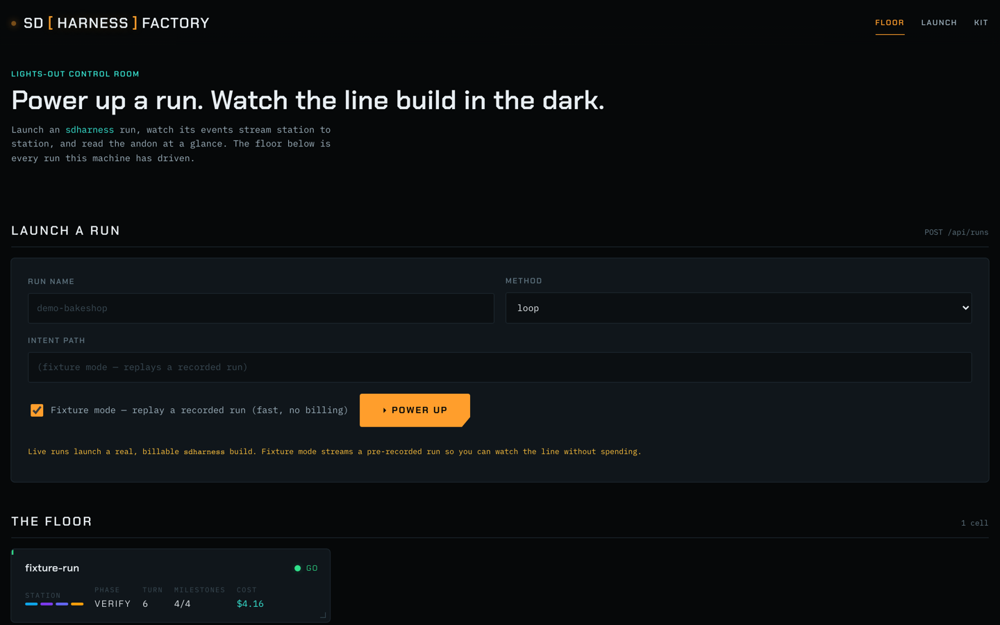
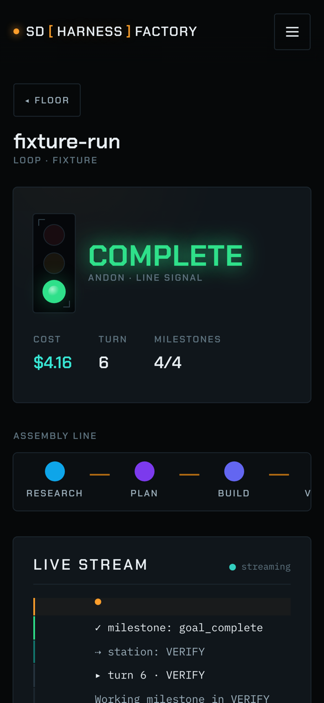

# Mini SD Harness Factory — an "art of the possible" example

The kit's maturity curve ends at **sdharness-factory**: a hosted, multi-user control plane that runs
the harness for a whole team. This example makes that rung tangible **on your laptop** — you hand the
SD Loop an intent, and it **builds a local control plane over the harness itself**: a browser page
that launches `sdharness` runs, streams their events live, and shows the result.

It's the factory's Phase-1 spine — *launch → observe → result* — scoped to local-first (a subprocess
runner instead of Fargate, a JSON/SQLite registry instead of DynamoDB, tailing `loop-docs/events.jsonl`
instead of a WebSocket). Same idea, no cloud.

## What the SD Loop builds

The intake sets the bar — a **"Lights-Out Factory Floor"**: the control room of a factory that builds and
verifies software autonomously (you supervise *outcomes*, not keystrokes). The loop designs and builds the
whole UI to that identity. A run in progress reads like an assembly line — phases as stations, the Pilot's
GO/NO_GO as an **andon stack-light**, live cost/turn/milestone telemetry:

![A run in the mini-factory: the SD [ HARNESS ] FACTORY control room — a green ANDON stack-light showing GO, an ASSEMBLY LINE of RESEARCH→PLAN→BUILD→VERIFY stations, and a live event stream, on a dark blueprint-grid canvas.](../../docs/assets/mini-factory-aws/lights-out/desktop-run-streaming.png)

The run list is a **factory floor** of machine cells (each concurrent run a cell):



…and the whole thing is responsive down to a phone — the andon stack-light, the result readout, and the
assembly line all reflow one-handed:

<p align="center"></p>

## The point

- **The kit builds the factory.** The SD Loop scaffolds the API + UI, wires the launch→stream→result
  seam, and self-verifies — then the built app *launches SD Loop runs*. The harness operating itself,
  one level up.
- **Consume, don't fork.** The control plane drives the real `sdharness` CLI and reads its real
  `events.jsonl` — it never re-implements the loop, gates, or event schema. That's the same boundary
  the production factory enforces (it imports sdharness as a pinned library).

## Build it

```bash
sdharness run ./examples/mini-factory --method loop
```

Or drive it agentically from Claude Code with the concierge skill: *"build the mini-factory example."*
When the run completes green, `cd` into its workspace and start the app (see the generated `README`),
then open it in the browser (via the IDE's `/proxy/<port>/`) — launch a small run and watch its events
stream in.

- `vision.md` — what to build + the checkable "Done =".
- `tech-env.md` — the local stack, the **consume-don't-fork** boundary, and cheap validation (a
  pre-recorded events fixture / a tiny `--max-turns` run, so VERIFY never needs a full build).

## Not in scope (that's the *real* factory)

Multi-user auth, AWS (Lambda/DynamoDB/Fargate/S3/CloudFront), the cross-run knowledge curator +
promotion-MRs, scheduling, dashboards. Those are what **sdharness-factory** adds — this example is the
teachable seed of the idea, not the platform.
