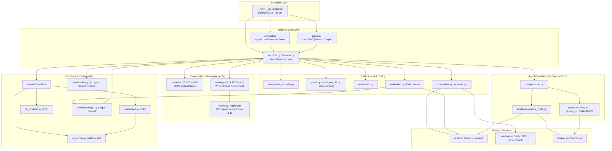
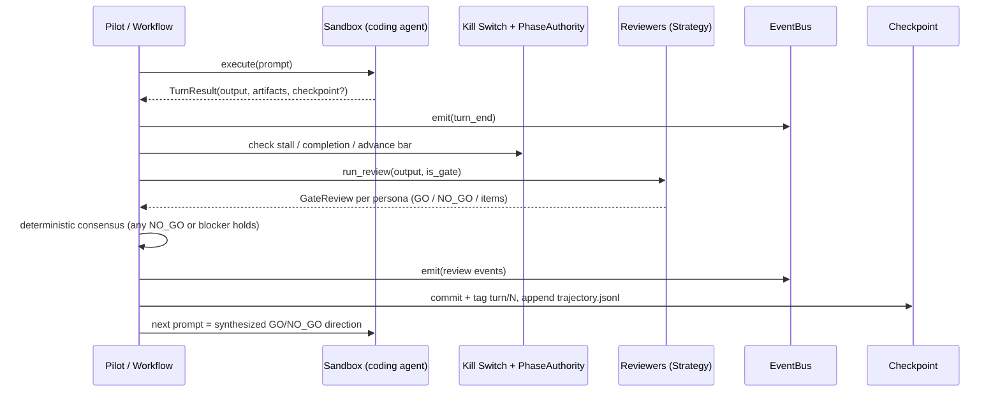
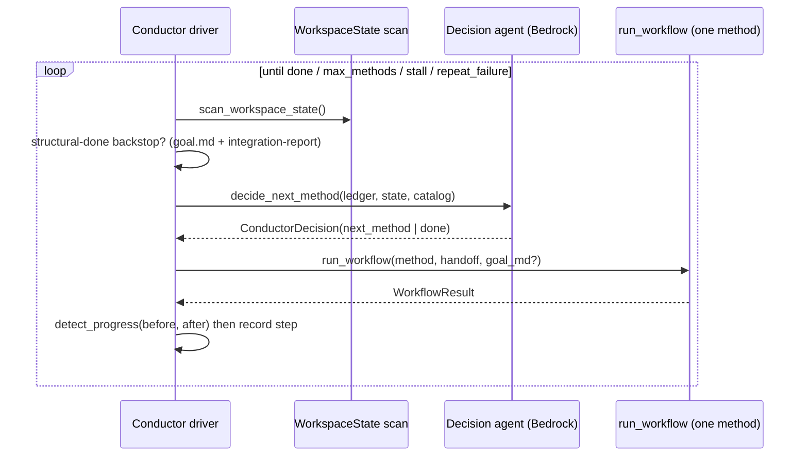

# System Architecture

## System Overview

SD Harness is a **single-process Python CLI application** structured as an *outer harness* that orchestrates an interchangeable *inner harness* (a coding agent). It is not a networked service — there is no server-side REST API; the "interfaces" are the CLI, in-process Python protocols, an event bus, and local observability servers (an SSE dashboard and a WebSocket bridge).

The architecture is built on three deliberate seams:

1. **Config over code** — Development methodologies (**Methods**, 15) and review styles (**Strategies**, 14) are declarative JSON + Markdown directories loaded at runtime. Adding either requires zero Python. A single **MCP registry** (`core/mcp_registry.py`) defines tool-server specs once (L1); strategies reference them by name, and `sdharness capabilities` resolves a method+strategy into its concrete `{skills, MCP servers, roles}` set (L2).
2. **Agent abstraction** — Any coding agent implements the `Sandbox` protocol; the harness only ever sees a generic `TurnResult` + optional `Checkpoint`. Claude Code is driven via the Claude Agent SDK; Kiro CLI, Gemini CLI, and Codex are driven via the Agent Communication Protocol (ACP).
3. **Event-driven orchestration** — All display, monitoring, persistence, and human-in-the-loop signalling flow through an `EventBus` whose envelope is EventBridge-compatible (a seam for a future AWS-hosted bus).

Layering is strict and downward-only: **Protocols → Sandboxes → Core/Harness → Orchestration (Workflow, Pipeline, Conductor) → CLI/Observability**.

## Architecture Diagram

**Text alternative:** The CLI dispatches to one of three orchestrators (Conductor, Pipeline, or a single Workflow run). Workflow composes a Method (phases/gates) with a Strategy (reviewers), applies the enforcement/quality components, and drives a coding agent through the `Sandbox` protocol (Claude Code via SDK, or Kiro/Gemini/Codex via ACP). All components emit through the EventBus, which feeds the SSE dashboard, WebSocket bridge, and terminal renderer; checkpoints persist to git. Model calls go to Amazon Bedrock; AWS facts are verified through MCP tools. Evaluation writes lessons into agent-context that seed later runs.

## Component Descriptions

### CLI / TUI (`__main__.py`, `commands.py`, `cli_ui/`)
- **Purpose**: Entry point and command dispatch; interactive guided mode.
- **Responsibilities**: argparse setup, alias transforms, subcommand handlers, template scaffolding UX.
- **Dependencies**: All orchestration layers, `runtime`, `resources`, `cli_ui`.
- **Type**: Application

### Workflow Engine (`workflow.py`, `harness.py`, `workflow_setup.py`, `turn_helpers.py`, `post_construction.py`)
- **Purpose**: Executes a single method run — the Plan → Execute → Validate → Remediate turn loop.
- **Responsibilities**: Workspace setup, per-turn agent execution, review orchestration, phase advancement, completion detection, post-construction verify/eval/remediate.
- **Dependencies**: `core/*`, `methods`, `strategies`, `sandboxes`, `events`, `checkpoint`, `verification`, `evaluation`.
- **Type**: Application

### Conductor (`conductor/`)
- **Purpose**: Agentic orchestrator that composes multiple methods toward a goal.
- **Responsibilities**: Scan workspace state, decide next method (Bedrock structured-output agent), synthesize handoffs, enforce method-cap / stall / repeat-failure guards, archive per-step events.
- **Dependencies**: `workflow.run_workflow`, `core/config_method`, `events`, `runtime`.
- **Type**: Application

### Pipeline (`pipeline/`)
- **Purpose**: Static DAG orchestrator for multi-method workflows.
- **Responsibilities**: Build a Strands `Graph` from a JSON config, run steps with `depends_on` edges, pass workspaces between steps, apply `on_failure` policy.
- **Dependencies**: `strands.multiagent.graph`, `workflow.run_workflow`, `events`.
- **Type**: Application

### Core abstractions (`core/`)
- **Purpose**: The contracts and shared engine primitives.
- **Responsibilities**: `protocols.py` (Sandbox/Method/Strategy + data models), `config_method`/`config_strategy` (JSON loaders + gate-predicate evaluation), `review.py` (review engine), `phase_authority.py` (deterministic advancement), `gate_diff`/`gate_script` (enforcement), `mcp_registry.py` (single source of MCP server specs — L1), `agent_factory`/`agent_tools` (Strands agent + tool creation), `knowledge`/`intent`/`drift`/`eval_rubric`/`session_store`.
- **Dependencies**: `pydantic`, `strands`, `events`, `runtime`.
- **Type**: Application (library core)

### Sandboxes (`sandboxes/`)
- **Purpose**: Concrete `Sandbox` implementations per coding agent.
- **Responsibilities**: `claude_code.py` (Claude Agent SDK, persistent sessions, hooks); `kiro_cli.py`/`gemini_cli.py`/`codex.py` (ACP via `_acp_common.py`).
- **Dependencies**: `claude-agent-sdk`, `agent-client-protocol`, `core/protocols`, `core/hooks`.
- **Type**: Application (adapters)

### Methods & Strategies (`methods/`, `strategies/`)
- **Purpose**: Declarative composition inputs.
- **Responsibilities**: Method dirs declare phases, gates, completion, subagents; Strategy dirs declare reviewers, routing, consensus.
- **Dependencies**: Loaded by `core/config_method`, `core/config_strategy`.
- **Type**: Configuration / Model

### EventBus (`events/`)
- **Purpose**: Event-driven orchestration backbone.
- **Responsibilities**: `schema.py` (EventBridge-compatible `HarnessEvent`), `bus.py` (`LocalEventBus` registry, emit/subscribe, HITL/milestone/steer signalling, JSONL persistence).
- **Dependencies**: `pydantic`.
- **Type**: Application (infrastructure)

### Observability (`dashboard.py`, `ws_server.py`, `cli_renderer.py`, `checkpoint.py`)
- **Purpose**: Live monitoring, resume, replay, audit.
- **Responsibilities**: SSE HTTP server + browser dashboard, WebSocket command/event bridge, Rich terminal rendering, git-based checkpointing.
- **Dependencies**: `events`, `rich`, `websockets`, `git` (subprocess).
- **Type**: Application

### Verification / Evaluation / Knowledge (`verification.py`, `evaluation.py`, `scoring.py`, `core/knowledge.py`)
- **Purpose**: Quality enforcement and the compounding flywheel.
- **Responsibilities**: Build/lint/security verification; 7-dimension scoring + remediation; lesson extraction into agent-context.
- **Dependencies**: `strands`, `events`, container/lang tooling (Finch, pnpm, pyright — optional).
- **Type**: Application

## Data Flow

### Key workflow: a single reviewed turn

**Text alternative:** The Pilot sends a prompt; the sandbox returns a `TurnResult`. The kill switch and PhaseAuthority run deterministic safety/advancement checks. Reviewers produce structured GO/NO_GO decisions; consensus is computed deterministically (any NO_GO or unresolved blocker holds the gate). Events are emitted throughout, a git checkpoint + trajectory record is written, and the synthesized direction becomes the next turn's prompt.

### Cross-method orchestration (Conductor)

**Text alternative:** The Conductor loops: scan workspace, check a deterministic structural-done backstop, ask a Bedrock decision agent for the next method (or done), run that method's workflow with a synthesized handoff, detect progress, and repeat until the goal is met or a guardrail (method cap, stall threshold, or repeat-failure) fires.

## Integration Points

- **External APIs**:
  - **Amazon Bedrock** — all model inference (reviewers, evaluator, steering/pilot, conductor decision agent, and the Claude Code coding agent via `CLAUDE_CODE_USE_BEDROCK`). Region-configurable, default `us-east-1`.
  - **AWS Price List API** — refreshes the Bedrock cost table (`pricing refresh`).
  - **Telemetry pixel** — fire-and-forget anonymous run-count GET (opt-out via `DISABLE_SDHARNESS_TELEMETRY`).
- **MCP servers (tool integration)**:
  - **A managed agent-toolkit MCP** (an HTTPS endpoint) — attached to reviewers and the coding agent for verified AWS facts.
  - **context7** (`npx @upstash/context7-mcp`) — library/API documentation lookup.
  - **nx-plugin-for-aws** (`npx @aws/nx-plugin-mcp`) — full-stack scaffolding for the coding agent.
  - **Playwright MCP** (pinned `--browser chromium`, #42) — drives the `html-mockup` method's default-on post-build render-verify pass (#43).
  - All specs are registered once in `core/mcp_registry.py` and referenced by name from strategies.
- **Databases**: None. State lives on the local filesystem (workspace files + `.sdharness/` sidecars) — the repository is the system of record.
- **Third-party runtimes**: Coding agent CLIs/SDKs (Claude Code, Kiro CLI, Gemini CLI, Codex); optional Finch (container build verification), pnpm (nx build/typecheck), pyright / typescript-language-server (in-agent diagnostics).

## Infrastructure Components

- **CDK Stacks / Terraform**: **None in this repository.** SD Harness *generates* IaC (CDK or Terraform) inside the *projects it builds*; it does not itself deploy cloud infrastructure. The `AWS_DEPLOY_PROFILE` / `AWS_DEPLOY_REGION` settings are consumed by the generated projects' `setup.sh`/`destroy.sh`.
- **Packaging & distribution**: Built as a Python wheel via `hatchling` + `hatch-vcs` (version derived from git tags). Runtime resources (`sdharness.json`, `agent-context/`, `plugins/`, `.claude-plugin/`) are force-included into `sdharness/_bundled/` so a clone-free `uv tool install git+…` works.
- **CI/CD (a pipeline config)**:
  - `package` stage — builds the wheel, asserts bundled resources are present and samples are excluded, installs into an isolated venv, and runs offline commands to prove resources resolve from the package.
  - `publish` stage — on `main` and tags, authenticates with short-lived credentials and uploads the wheel to a **private package registry**.
  - `pyright` + `pytest` run **locally before push**, not in CI.
- **Local runtime servers**: SSE dashboard HTTP server (default port **8089**) and a WebSocket server — both bound locally for a single operator; no authentication layer (acceptable for a local single-user tool, but a consideration if ever exposed).
- **Data locations**: Per-user writable data in `~/.local/share/sdharness/` (`.env`, edited `sdharness.json`, accumulated `agent-context/`); per-run state in the project workspace under `.sdharness/` (events.jsonl, trajectory.jsonl, conductor logs, review scratchpads).
