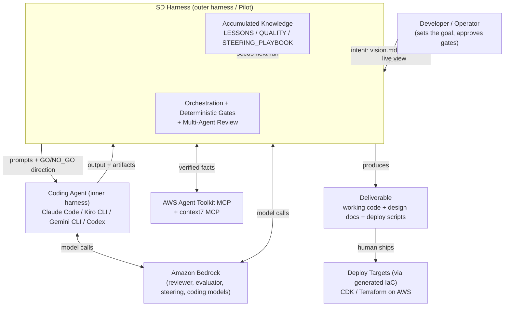

# Business Overview

## Business Context Diagram

**Text alternative:** A developer supplies project intent (a `vision.md`/`goal.md` or a `--goal` steer). SD Harness (the outer harness / "Pilot") decomposes and drives an interchangeable coding agent (the inner harness) turn by turn, calling Amazon Bedrock models for both sides and verifying AWS facts through MCP tools. Every run accumulates knowledge that seeds the next run. The output is a working application plus design docs and deploy scripts, which a human then ships to AWS via the generated infrastructure-as-code.

## Business Description

- **Business Description**: **SD Harness (Self-Driving Harness)** is an experimental Python command-line tool that orchestrates AI coding agents to run a **complete software-development lifecycle autonomously**. It implements "harness engineering": an *outer harness* (the Pilot, built on the Strands Agents SDK) drives an *inner harness* (an interchangeable coding agent) through structured development phases, enforcing quality with deterministic gates and adversarial multi-agent review instead of a human reviewer. The stated value proposition is to **elevate a developer from reviewer to decision-maker** — the harness handles "did they follow the process / is this sound / should we proceed", and the human intervenes only at milestones. A secondary business goal is **compound engineering**: every run extracts lessons that improve subsequent runs, so the system gets better at building the same categories of project without human intervention.

- **Business Transactions** (the primary units of value the system delivers):
  - **Run a method (`run`)** — Drive one development methodology (e.g. `aidlc-lite`, `sdd`, `frontend`, `waf`) end to end on a project, producing reviewed code plus design artifacts. The core transaction.
  - **Intake (`intake`)** — Conduct an AI interview that turns a rough idea into a structured intent document (`vision.md`/`spec.md`) the harness can drive from.
  - **Scaffold (`scaffold`)** — Create a new project workspace from a template (e.g. an Nx full-stack workspace) before the first turn.
  - **Compose a pipeline (`pipeline`)** — Execute several methods + strategies as one declared, unattended DAG (e.g. build → harden → assess), passing artifacts between steps.
  - **Conduct (`conduct`)** — Agentically drive a project *across multiple methods* toward a goal: an orchestrator observes the workspace after each method, picks the next one, and synthesizes the handoff — the dynamic alternative to a hand-authored pipeline.
  - **Review & gate a turn** — At each gate, run multi-perspective review (1–6 persona reviewers with veto authority), reach consensus (GO / GO_WITH_CONDITIONS / NO_GO), and advance the phase only when deterministic artifact criteria are met.
  - **Verify & evaluate** — Build-verify the output (lint / test / security scan) and score it across quality dimensions, remediating critical findings.
  - **Compound knowledge** — Extract build, quality, and steering lessons from a run into knowledge files that seed the next run. Now includes an explicit **`compound`** command that promotes a finished run's `progress.md` `## Patterns` into the `LESSONS.md` seed (the compound-engineering write-back made a first-class step).
  - **Inspect capabilities (`capabilities`)** — Resolve a method + strategy into the concrete `{skills, MCP servers, reviewer roles}` it will scaffold, so an operator (or a driving agent) can see exactly what a method pulls in before running it.
  - **Inspect / replay / monitor** — Review a run's turn-by-turn history, replay its event stream in terminal or browser dashboard, and track cost.
  - **Graduate (`graduate`)** — Export a finished run as a clean hand-off repository (strip scaffolding, relocate design docs, fresh single-commit git, generated README + architecture diagram).
  - **Preflight (`preflight`)** — Validate plugins, dependencies, sandbox, and AWS access before a run.

- **Business Dictionary**:
  - **Outer Harness / Pilot**: The orchestration layer (Strands agents) that reviews output, makes GO/NO_GO decisions, and steers the next step. Simulates a human developer.
  - **Inner Harness / Coding Agent**: The interchangeable AI tool that actually writes code (Claude Code, Kiro CLI, Gemini CLI, Codex).
  - **Method**: A declarative JSON+Markdown config that defines *what* development phases, gates, and completion criteria to follow. Method-agnostic — added without touching harness code.
  - **Strategy**: A declarative JSON+Markdown config that defines *who* reviews and *how* consensus is reached (reviewer personas, routing, consensus rule).
  - **Sandbox**: The execution boundary wrapping a coding agent (implements the `Sandbox` protocol).
  - **Gate**: A checkpoint where the Pilot must approve before the agent continues; a single NO_GO from any specialist blocks it (domain veto).
  - **PhaseAuthority**: The deterministic owner of phase advancement — no phase advances without artifact "proof".
  - **Kill Switch**: Deterministic loop-safety net (stall / no-file / repeated-error / budget caps).
  - **Pipeline**: A static, declared DAG of method+strategy steps.
  - **Conductor**: An agentic orchestrator *above* the Pilot that decides which method runs next and loops toward a goal.
  - **HITL / AITL**: Human-in-the-Loop vs Agent-in-the-Loop gate answering; `--yolo` mode is fully autonomous (AITL).
  - **Advisory Board / Mob**: The multi-reviewer panel (Product Owner, Tech Lead, Security, SRE, QA, SA/PA).
  - **Graduate**: Exporting a run as a clean deliverable repo.
  - **Compound Engineering**: Making every run improve the next via accumulated lessons.

## Component Level Business Descriptions

### CLI & Interactive TUI (`sdharness/__main__.py`, `commands.py`, `cli_ui/`)
- **Purpose**: The product's user interface — how developers/operators invoke every business transaction.
- **Responsibilities**: Parse subcommands (`run`, `conduct`, `pipeline`, `intake`, `scaffold`, `graduate`, etc.), offer a guided interactive mode, and dispatch to command handlers.

### Workflow Engine (`sdharness/workflow.py`, `harness.py`, `workflow_setup.py`)
- **Purpose**: Executes the core "run a method" transaction — the turn-by-turn conversation between Pilot and coding agent.
- **Responsibilities**: Set up the workspace, run the Plan → Execute → Validate → Remediate turn loop, apply gates and reviews, and detect completion.

### Methods (`sdharness/methods/`)
- **Purpose**: Encode the development methodologies the business offers as products (15 methods, from adaptive `aidlc-lite` and rapid `html-mockup` to production-hardening `waf`).
- **Responsibilities**: Declare phases, gates, completion contracts, subagents, and the validated default strategy per methodology.

### Strategies (`sdharness/strategies/`)
- **Purpose**: Encode the review styles offered (14 strategies, from a single steering agent to a 6-persona advisory board).
- **Responsibilities**: Declare reviewer personas, routing, execution mode, and consensus rules.

### Conductor (`sdharness/conductor/`)
- **Purpose**: Delivers the "drive a project across methods toward a goal" transaction — the dynamic orchestrator.
- **Responsibilities**: Observe workspace state, decide the next method, synthesize handoffs, and terminate on completion / cap / stall.

### Pipeline (`sdharness/pipeline/`)
- **Purpose**: Delivers the "compose multiple methods as one unattended workflow" transaction (static DAG).
- **Responsibilities**: Build a dependency graph of steps and run them with artifact passing and failure policy.

### Enforcement & Quality (`sdharness/core/phase_authority.py`, `gates.py`, `verification.py`, `evaluation.py`, `preflight.py`)
- **Purpose**: Replaces human oversight with deterministic, harness-owned enforcement — the differentiator behind the "reviewer → decision-maker" thesis.
- **Responsibilities**: Own phase advancement, enforce artifact gates, run build/lint/security verification, score quality, and validate readiness.

### Knowledge / Compounding (`sdharness/evaluation.py`, `core/knowledge.py`, `agent-context/`)
- **Purpose**: Delivers compound engineering — turning run outcomes into reusable organizational knowledge.
- **Responsibilities**: Extract lessons into `LESSONS.md` / `QUALITY.md` / `STEERING_PLAYBOOK.md` and inject them (budget-filtered) into later runs.

### Observability (`sdharness/dashboard.py`, `ws_server.py`, `cli_renderer.py`, `checkpoint.py`, `events/`)
- **Purpose**: Lets operators watch, resume, replay, and audit runs — the transparency the autonomy thesis depends on.
- **Responsibilities**: Stream events (SSE dashboard + WebSocket bridge), render the terminal conversation, and persist an auditable, resume-safe trail (events.jsonl, git checkpoints, trajectory.jsonl).
