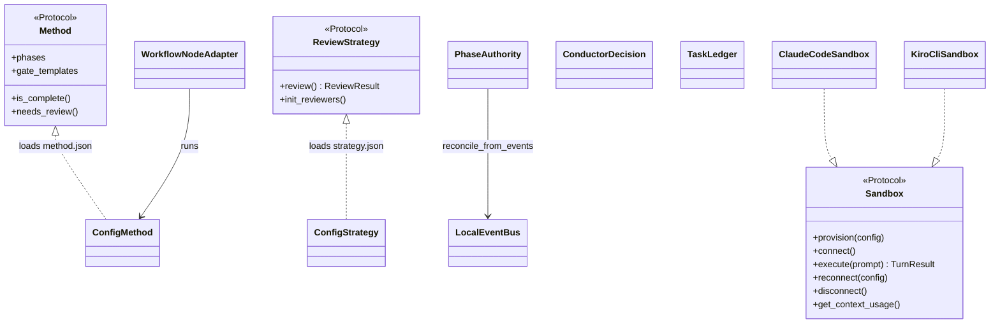

# Code Structure

## Build System

- **Type**: Python packaging with **hatchling** (build backend) + **hatch-vcs** (version from git tags); **uv** as the package/dependency manager and tool installer.
- **Configuration**:
  - `pyproject.toml` — project metadata, runtime dependencies, `[dependency-groups] dev` (pytest, pytest-asyncio, pyright==1.1.409), console script `sdharness = sdharness.__main__:main`, and `[tool.hatch.build.targets.wheel.force-include]` bundling runtime resources into `sdharness/_bundled/`.
  - `pyrightconfig.json` — static type-check configuration.
  - `Makefile` — release helpers (`version`, `release NEW=x.y.z`).
  - a CI config — wheel packaging + package-registry publish.
  - `sdharness.json` — runtime configuration (models, review/eval/agent settings, pricing table, dashboard port).
  - `uv.lock` — fully pinned dependency lockfile.

## Repository Layout (top level)

```
analysis-target/sdharness/
+-- sdharness/            # the Python package (orchestrator) — ~28.8k LOC
+-- tests/                # pytest suite — 65 test files, ~13.4k LOC
+-- plugins/              # 38 coding-agent skill/plugin dirs (14 vendored AWS core skills + ai-plc + aidlc, ebc, frontend, ...)
+-- agent-context/        # read-only SEED: CLAUDE.md, QUALITY.md, LESSONS.md, methods/, templates/
+-- docs/                 # 54 architecture & method docs (30 top-level)
+-- sample-use-cases/     # 10 demo intent projects (not bundled)
+-- sample-pipelines/     # 3 example pipeline JSON configs
+-- eval/                 # evaluation harness: golden cases, experiments, results
+-- scripts/              # setup + spike scripts
+-- assets/               # architecture/title images
+-- pyproject.toml, sdharness.json, Makefile, .gitlab-ci.yml, README.md, CLAUDE.md
```

## Key Classes / Modules



**Text alternative:** Three runtime-checkable Protocols anchor the design — `Sandbox` (coding-agent boundary), `Method` (what to build), `ReviewStrategy` (who reviews). `ConfigMethod`/`ConfigStrategy` implement Method/Strategy by loading JSON directories. Concrete sandboxes (Claude Code, Kiro CLI, etc.) implement `Sandbox`. `PhaseAuthority` owns deterministic phase advancement and reconciles from the `LocalEventBus`. The Conductor uses `TaskLedger` + `ConductorDecision` (Magentic-One dual-ledger).

### Existing Files Inventory

**Top-level orchestrator modules (`sdharness/`)** — candidates for modification in brownfield changes:
- `sdharness/__init__.py` — package version resolution.
- `sdharness/__main__.py` — CLI entry point: argparse, alias transforms, dispatch table.
- `sdharness/commands.py` — CLI command handlers (`cmd_run`, `cmd_conduct`, `cmd_pipeline`, `cmd_scaffold`, `cmd_graduate`, `cmd_preflight`, `cmd_inspect`, `cmd_compound`, `cmd_interactive`, …) — largest module (~128 KB, 3,182 LOC). (`cmd_capabilities` lives in `__main__.py` alongside the argparse setup.)
- `sdharness/harness.py` — stateless outer orchestrator; owns the turn loop (~99 KB, 1,910 LOC).
- `sdharness/workflow.py` — `run_workflow()`; drives one method through its phases (~48 KB).
- `sdharness/workflow_setup.py` — sequential setup steps for `run_workflow` (~37 KB).
- `sdharness/post_construction.py` — post-construction: metrics, reports, build verification, evaluation, lesson flush.
- `sdharness/turn_helpers.py` — pure helper functions extracted from the turn loop.
- `sdharness/agent.py` — Claude Code SDK turn execution.
- `sdharness/reviewer.py` — `Reviewer` class, reviewer setup + routing.
- `sdharness/evaluation.py` — post-run 7-dimension evaluation + lesson extraction.
- `sdharness/verification.py` — build/lint/security verification (~38 KB).
- `sdharness/preflight.py` — pre-run validation (plugins, deps, sandbox, AWS).
- `sdharness/gates.py` — stage manager, gate detection, conflict resolution.
- `sdharness/graduate.py` — clean hand-off repo export.
- `sdharness/scaffolding.py` — single source of truth for skill/MCP completeness (shared by CI test + preflight).
- `sdharness/models.py` — shared Enums + Pydantic models (`ReviewerRole`, `GateReview`, `TurnRecord`, `WorkflowResult`, `BuildVerification`, …).
- `sdharness/runtime.py` — runtime config, `.env` loading, Bedrock model IDs, region/boto session, cost utilities.
- `sdharness/dashboard.py` — EventBus facade + SSE HTTP server (~48 KB).
- `sdharness/cli_renderer.py` — Rich Live terminal renderer (~51 KB).
- `sdharness/ws_server.py` — WebSocket event/command bridge.
- `sdharness/checkpoint.py` — git per-turn checkpointing + trajectory log + worktree branching.
- `sdharness/hooks.py` — Claude SDK hook adapter (thin wiring to `core/hooks.py`).
- `sdharness/scoring.py` — scoring + report formatting.
- `sdharness/resources.py` — bundled vs per-user resource resolution.
- `sdharness/telemetry.py` — fire-and-forget usage analytics.
- `sdharness/log.py` — terminal logging + phase styles.

**Core (`sdharness/core/`, 16 modules):** `protocols.py`, `config_method.py`, `config_strategy.py`, `agent_factory.py`, `agent_tools.py`, `review.py`, `hooks.py`, `gate_diff.py`, `gate_script.py`, `mcp_registry.py`, `phase_authority.py`, `knowledge.py`, `intent.py`, `drift.py`, `eval_rubric.py`, `session_store.py`.

**Subpackages:**
- `sdharness/events/` — `schema.py` (`HarnessEvent`), `bus.py` (`LocalEventBus`, registry).
- `sdharness/conductor/` — `models.py`, `agent.py`, `state.py`, `driver.py`.
- `sdharness/pipeline/` — `models.py`, `adapter.py`, `orchestrator.py`.
- `sdharness/sandboxes/` — `claude_code.py`, `kiro_cli.py`, `gemini_cli.py`, `codex.py`, `_acp_common.py`.
- `sdharness/methods/` — 15 method dirs (each: `method.json` + `system-prompt.md` + optional `eval_rubric.json` / state template).
- `sdharness/strategies/` — 14 strategy dirs (each: `strategy.json` + reviewer/steering `.md` files).
- `sdharness/prompts/` — 16 system-prompt Markdown files (conductor, evaluator, facilitator, pilot, reviewer-*, router, stage-manager, extractors).
- `sdharness/templates/` — 9 project scaffold templates as JSON (nx-fullstack, nx-website, nx-agent, frontend-minimal, harness-default, harness-browser, harness-coder, harness-container, harness-mcp).
- `sdharness/cli_ui/` — modular Rich TUI (`_primitives`, `_menus`, `_confirm`, `_scaffold`, `_templates`).
- `sdharness/eval_rubrics/` — `base.json` base rubric.
- `sdharness/assets/` — `dashboard.html` and images.

## Design Patterns

### Strategy / Plugin via Protocols + config loading
- **Location**: `core/protocols.py` + `core/config_method.py` + `core/config_strategy.py`; `methods/`, `strategies/`.
- **Purpose**: Add methodologies and review styles without touching harness code.
- **Implementation**: `runtime_checkable` `Protocol` classes define the contract; `ConfigMethod`/`ConfigStrategy.from_dir()` load a directory of JSON+Markdown into an object satisfying the protocol.

### Adapter
- **Location**: `sandboxes/*` (coding agents behind the `Sandbox` protocol); `pipeline/adapter.py` (`WorkflowNodeAdapter` wraps `run_workflow` as a Strands `MultiAgentBase` graph node); `hooks.py` (SDK hooks → agent-agnostic `core/hooks.py`).
- **Purpose**: Bridge heterogeneous agent runtimes and framework interfaces to internal contracts.
- **Implementation**: `_acp_common.py` shares ACP handling across Kiro/Gemini/Codex; the Claude sandbox uses the Claude Agent SDK directly.

### Event-driven / Observer (EventBridge-shaped)
- **Location**: `events/bus.py` (`LocalEventBus`, `EventRule`, `EventBusProtocol`); consumers in `dashboard.py`, `ws_server.py`, `cli_renderer.py`.
- **Purpose**: Decouple orchestration from display, persistence, and HITL; provide a resume-safe audit log and a seam for a hosted AWS EventBridge bus.
- **Implementation**: Named-bus registry (`get_bus(id)`), plain-callback and rule-based subscriptions, JSONL persistence, blocking HITL/milestone waits and non-blocking operator "steers".

### State machine / Authority object
- **Location**: `core/phase_authority.py` (`PhaseAuthority`, `PhaseState`, `PhaseAdvanceResult`); gate-predicate evaluation in `core/config_method.py`; method `phase_advancement` + `completion` config.
- **Purpose**: Deterministic, artifact-proven phase advancement; no phase advances on narration alone.
- **Implementation**: `evaluate_after_turn`, `resolve_milestone`, `reconcile_from_events`, glob/`implies`/`not` gate predicates, plus **line-anchored checkbox matching** and first-class **`no_unchecked`**/**`checkbox_min_checked`** leaves (#40/#41) so an "all items checked" gate is proven structurally rather than by a brittle prose `file_contains`; two runtime guards prevent a mis-specified gate from spinning the loop.

### Dual-ledger orchestrator (Magentic-One inspired)
- **Location**: `conductor/models.py` (`TaskLedger` outer state + `ConductorDecision` progress ledger), `conductor/driver.py`.
- **Purpose**: Agentic method sequencing with progress self-check and anti-loop guardrails.
- **Implementation**: Decision agent emits a validated `ConductorDecision`; the driver enforces method cap, stall threshold, and a `(method, failure-class)` repeat-failure cap.

### Factory
- **Location**: `core/agent_factory.py` (`create_agent`).
- **Purpose**: Single place all Strands structured-output agents (reviewers, gate, evaluator, conductor, steering) are built and metered.

## Critical Dependencies

### strands-agents (`>=1.44.0`) + strands-agents-tools (`>=0.8.1`)
- **Usage**: Powers every outer-harness agent — reviewers, facilitator, evaluator, steering, conductor decision agent — and the Pipeline DAG via `GraphBuilder`/`Graph`.
- **Purpose**: The outer-harness (Pilot) agent framework; structured output + multi-agent graph primitives.

### claude-agent-sdk (`>=0.2.105`)
- **Usage**: `sandboxes/claude_code.py` — drives Claude Code as the inner harness with persistent sessions and hooks.
- **Purpose**: The primary (default) coding-agent runtime.

### agent-client-protocol (`>=0.10.1`)
- **Usage**: `sandboxes/_acp_common.py` + Kiro/Gemini/Codex sandboxes.
- **Purpose**: Speak ACP to non-Claude coding agents — the agent-agnostic seam.

### pydantic
- **Usage**: Every data model and config schema (project convention: no `@dataclass`).
- **Purpose**: Validation, structured-output typing, JSON (de)serialization.

### mcp (`>=1.28.0`)
- **Usage**: Attach AWS Agent Toolkit / context7 / nx-plugin MCP servers to reviewers and the coding agent.
- **Purpose**: Verified external facts and scaffolding capabilities.

### rich / questionary / prompt-toolkit
- **Usage**: `cli_renderer.py`, `cli_ui/`, dashboard HTML.
- **Purpose**: Conversational terminal rendering and interactive guided mode.

### websockets / botocore
- **Usage**: `ws_server.py` (event/command bridge); `runtime.py` (boto session, Bedrock/pricing, credential resolution).
- **Purpose**: Distributed frontends and AWS SDK access.
