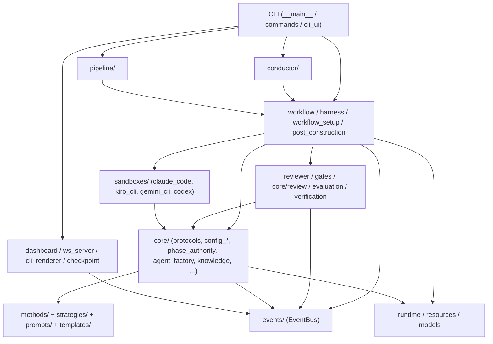

# Dependencies

## Internal Dependencies

SD Harness is a single package; "internal dependencies" are the layered relationships between its subpackages/module groups. The layering is downward-only (no upward imports), a stated design principle.

**Text alternative:** The CLI sits on top and calls the three orchestrators (Conductor, Pipeline, Workflow). Conductor and Pipeline both call the single-method Workflow. Workflow depends on the Review/quality group, Core, Sandboxes, and the EventBus. Review depends on Core and EventBus. Core loads the declarative Config (methods/strategies/prompts) and emits to EventBus. Sandboxes depend on Core (protocols/hooks). Observability consumes EventBus. Runtime/resources/models are the shared foundation everything reads.

### Selected internal dependency edges

- **CLI → Workflow / Pipeline / Conductor** — *Runtime* — command handlers dispatch to the chosen orchestrator.
- **Conductor → Workflow** — *Runtime* — the driver runs each chosen method via `run_workflow`.
- **Pipeline → Workflow** — *Runtime* — `WorkflowNodeAdapter` wraps `run_workflow` as a Strands graph node.
- **Workflow → Core (protocols/config/phase_authority/review)** — *Runtime* — composes Method + Strategy, enforces advancement.
- **Sandboxes → Core (protocols, hooks)** — *Compile/Runtime* — implement `Sandbox`, translate agent-agnostic `HookSpec`/`GateDecision`.
- **Everything → EventBus** — *Runtime* — emit/subscribe for display, persistence, HITL.
- **Core → methods/strategies (JSON)** — *Runtime (data)* — `ConfigMethod`/`ConfigStrategy` load config dirs.
- **resources.py** — *Runtime* — every resource read goes through it (bundled vs per-user), never `Path(__file__).parent.parent`.

## External Dependencies

### Runtime (from `pyproject.toml [project.dependencies]`)

| Dependency | Version | Purpose | License* |
|-----------|---------|---------|----------|
| `strands-agents` | `>=1.44.0` | Outer-harness agent framework (reviewers, evaluator, steering, conductor); Pipeline DAG. | Apache-2.0 |
| `strands-agents-tools` | `>=0.8.1` | Tool implementations for Strands agents (file read/write, editor, etc.). | Apache-2.0 |
| `claude-agent-sdk` | `>=0.2.105` | Drive Claude Code as the default coding agent. | MIT |
| `agent-client-protocol` | `>=0.10.1` | ACP client for Kiro/Gemini/Codex sandboxes. | Apache-2.0 |
| `mcp` | `>=1.28.0` | Model Context Protocol client (AWS Toolkit, context7, nx-plugin). | MIT |
| `pydantic` | (unpinned) | Data models, config schemas, structured output. | MIT |
| `rich` | (unpinned) | Terminal rendering. | MIT |
| `questionary` | (unpinned) | Interactive prompts. | MIT |
| `prompt-toolkit` | (unpinned) | Interactive input primitives. | BSD-3-Clause |
| `websockets` | (unpinned) | WebSocket event/command bridge. | BSD-3-Clause |
| `botocore` | (unpinned) | AWS SDK core (Bedrock, credentials, pricing). | Apache-2.0 |

\* Licenses are the well-known upstream licenses for these packages, listed for reference; they are **not declared in this repo** and should be verified against `uv.lock` / upstream metadata before any distribution decision.

### Development (from `[dependency-groups] dev`)

| Dependency | Version | Purpose |
|-----------|---------|---------|
| `pytest` | (unpinned) | Test runner. |
| `pytest-asyncio` | (unpinned) | Async test support. |
| `pyright` | `==1.1.409` | Static type checker (pinned). |

### Build-system (from `[build-system]`)

| Dependency | Purpose |
|-----------|---------|
| `hatchling` | Wheel build backend. |
| `hatch-vcs` | Git-tag-derived versioning. |

### Transitive / external runtime tools (not Python deps)

- **Node.js + Claude Code CLI** — coding agent runtime (required for default sandbox).
- **uv** — install/build/dependency management.
- **git** — checkpointing, version derivation, some tests shell out to it.
- **Finch** (optional) — container build verification.
- **pnpm** (optional) — nx scaffolding + full-stack typecheck.
- **pyright / typescript-language-server** (optional) — in-agent diagnostics.
- **npx-spawned MCP servers** — `@upstash/context7-mcp`, `@aws/nx-plugin-mcp`.

### Managed external services

- **Amazon Bedrock** (all model inference), **a managed agent-toolkit MCP endpoint**, **a private package registry** (publish), **AWS Price List API** (pricing refresh), **a Git host** (source + CI), **telemetry pixel** (opt-out).

## Dependency Observations

- **Version pinning is loose at the top level** — only the agent/SDK/protocol/MCP dependencies carry lower bounds; foundational libs (`pydantic`, `rich`, `botocore`, etc.) are unpinned in `pyproject.toml`. Reproducibility is provided by `uv.lock` (a full pinned lockfile) rather than by `pyproject.toml` constraints.
- **Tight coupling to the AI-agent ecosystem** — the value proposition depends on three fast-moving SDKs (Strands, Claude Agent SDK, ACP) and Bedrock model IDs baked into `sdharness.json`; model catalog and pricing carry an explicit `as_of` date and will drift.
- **No database or ORM dependency** — state is filesystem-based (workspace + `.sdharness/` sidecars + git), consistent with the "repository as system of record" principle.
